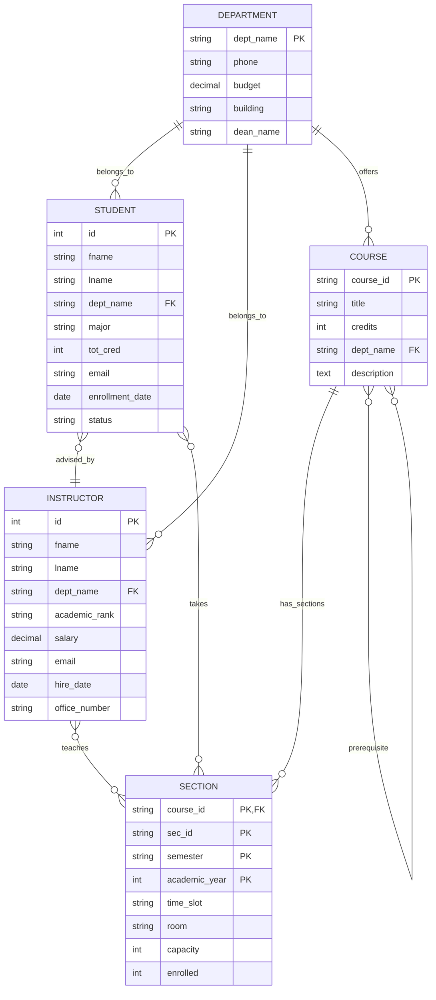

# University Database Management System

A database management system for universities built with Python and SQLite. Manages students, instructors, courses, sections, enrollments, and academic records.

## Features

- Department management
- Student records and enrollment
- Instructor management and assignments
- Course catalog with prerequisites
- Section scheduling and capacity tracking
- Grade assignment and GPA calculation
- Academic advising relationships

## Requirements

- Python 3.8+
- SQLite3 (included with Python)

## Usage

### Basic Example

```python
from university_db import AdminQueryHandler

# Create or connect to database
with AdminQueryHandler("university.db") as db:
    # Create a department
    db.create_dept("Computer Science", "555-0123", 100000.0, "Tech Building", "Dr. Smith")
    
    # Create a student
    student_id = db.create_student("John", "Doe", "Computer Science", "john@university.edu")
    
    # Create a course
    db.create_course("CS101", "Introduction to Programming", 3, "Computer Science")
    
    # Create a section
    db.create_section("CS101", "A", "Fall", 2024, "MWF 10:00-11:00", "Room 101", 30)
    
    # Enroll student
    db.enroll_student(student_id, "CS101", "A", "Fall", 2024)
```

### Common Operations

#### Student Management

```python
# Get student information
student = db.get_student_info(student_id)

# Update student details
db.update_student(student_id, major="Software Engineering", tot_cred=15)

# Get student transcript
transcript = db.get_student_transcript(student_id)

# Calculate GPA
gpa = db.calculate_gpa(student_id)
```

#### Course and Section Management

```python
# Get all courses in a department
courses = db.get_all_courses("Computer Science")

# Get section details
section = db.get_section_info("CS101", "A", "Fall", 2024)

# Assign instructor to section
db.assign_instructor(instructor_id, "CS101", "A", "Fall", 2024)
```

#### Grade Management

```python
# Assign grade to student
db.assign_grade(student_id, "CS101", "A", "Fall", 2024, "A")

# Get enrollment information
enrollment = db.get_enrollment_info(student_id, "CS101", "A", "Fall", 2024)
```

## Database Schema

The system uses the following main tables:

- **department**: Academic departments
- **student**: Student records and information
- **instructor**: Faculty information
- **course**: Course catalog
- **section**: Class sections with scheduling
- **takes**: Student enrollments and grades
- **teaches**: Instructor assignments
- **advisor**: Student-advisor relationships
- **prereq**: Course prerequisites

## Data Validation

The system includes validation for:

- Email format validation
- Date format (YYYY-MM-DD)
- Semester values (Fall, Winter, Spring, Summer)
- Grade values (A+ through F)
- Academic ranks for instructors
- Time slot format (e.g., "MWF 10:00-11:00")
- Positive values for credits, salary, and capacity

## Error Handling

Custom exceptions are provided for common errors:

- `RecordNotFound`: When querying non-existent records
- `InvalidEmail`: For malformed email addresses
- `UnsupportedDateFormat`: For invalid date formats
- `IncorrectTimeslot`: For invalid time slot formats
- `IncorrectValue`: For invalid field values
- `DataBaseError`: For SQLite database errors

## Example: Complete Workflow

```python
with AdminQueryHandler("university.db") as db:
    # Setup department and instructor
    db.create_dept("Mathematics", "555-0456", 75000.0, "Math Building", "Dr. Johnson")
    instructor_id = db.create_instructor(
        "Jane", "Smith", "Mathematics", "jane.smith@university.edu",
        "Professor", 80000.0
    )
    
    # Create course and section
    db.create_course("MATH101", "Calculus I", 4, "Mathematics")
    db.create_section("MATH101", "1", "Spring", 2024, "TTh 14:00-15:15", "Math 201", 25)
    db.assign_instructor(instructor_id, "MATH101", "1", "Spring", 2024)
    
    # Create and enroll student
    student_id = db.create_student("Alice", "Brown", "Mathematics", "alice@university.edu")
    db.enroll_student(student_id, "MATH101", "1", "Spring", 2024)
    
    # Assign grade and check GPA
    db.assign_grade(student_id, "MATH101", "1", "Spring", 2024, "A-")
    gpa = db.calculate_gpa(student_id)
    print(f"Student GPA: {gpa}")
```

## Database Diagram

### Entity Relationships


